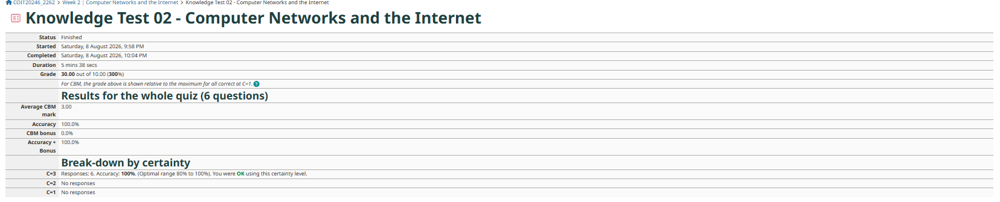

# Week 01 Journal – Unit Introduction

**Assessment:** COIT20246 Assessment 1 Part A  

    
**Student Name:** Rohit Hargovanbhai Prajapati  
**Student ID:** 12326317

---

# Task 1 – Knowledge Test

The Week 0 Knowledge Test was completed through Moodle as required.

---

# Task 2 – Welcome Video

I watched the **Welcome to COIT20246** video available on Moodle. The video introduced the unit structure, assessment requirements, learning resources, and the importance of maintaining a GitHub journal throughout the trimester.

---

# Task 3 – Moodle Exploration

I explored the Moodle site and reviewed the following sections:

- Unit Introduction
- Learning Community
- Classes
- Assessment
- Week 1 Learning Materials

During this activity, I identified:

- The location of lecture recordings (Echo360).
- The lecture slides in PDF and PowerPoint formats.
- The GitHub journal requirements.
- Assessment and quiz information available within Moodle.

---

# Task 4 – GitHub Journal Setup

The following GitHub setup tasks were completed:

- Created (or confirmed) my GitHub account.
- Created a private GitHub journal repository.
- Added a README file.
- Saved the repository URL.
- Added my tutor as a collaborator.

---

# Task 5 – Current Knowledge and Experience

My current understanding of computer networking includes concepts such as IPv4 and IPv6 addressing, routers, switches, DNS, DHCP, and wireless networking. I have previously used networking tools such as `ipconfig`, `ping`, and basic PowerShell commands to view network configuration and troubleshoot connectivity issues.

I have a basic understanding of cyber security concepts including authentication, encryption, malware, phishing attacks, firewalls, and secure password practices. These concepts help protect computer systems, networks, and sensitive information from unauthorized access and cyber threats.

I am also familiar with cloud computing services, where computing resources such as virtual machines, storage, and applications are delivered over the Internet. I have previously explored virtualization and cloud technologies using platforms such as VirtualBox and cloud service providers during my studies and personal learning.

Overall, I have gained my current knowledge through previous coursework, practical activities, online learning resources, and hands-on experience using Windows, Linux, GitHub, and networking tools.

---

## Knowledge Test Screenshot

---

# Task 6 – Microsoft Teams

I accessed the Microsoft Teams site for COIT20246 through Moodle and joined the General channel as instructed.

---

# Reflection

This week's activities helped me become familiar with the structure of the unit, the assessment requirements, and the tools that will be used throughout the trimester. Creating the GitHub journal and exploring Moodle provided a clear understanding of how weekly activities and evidence will be recorded and submitted.

