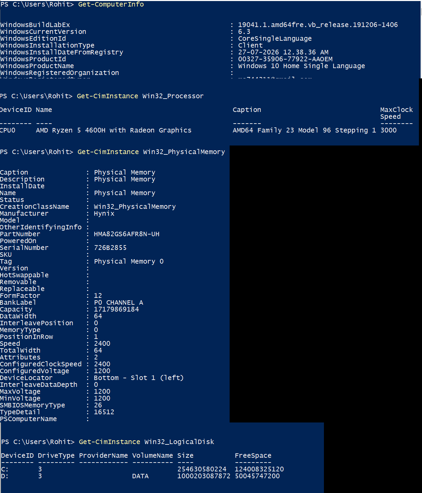
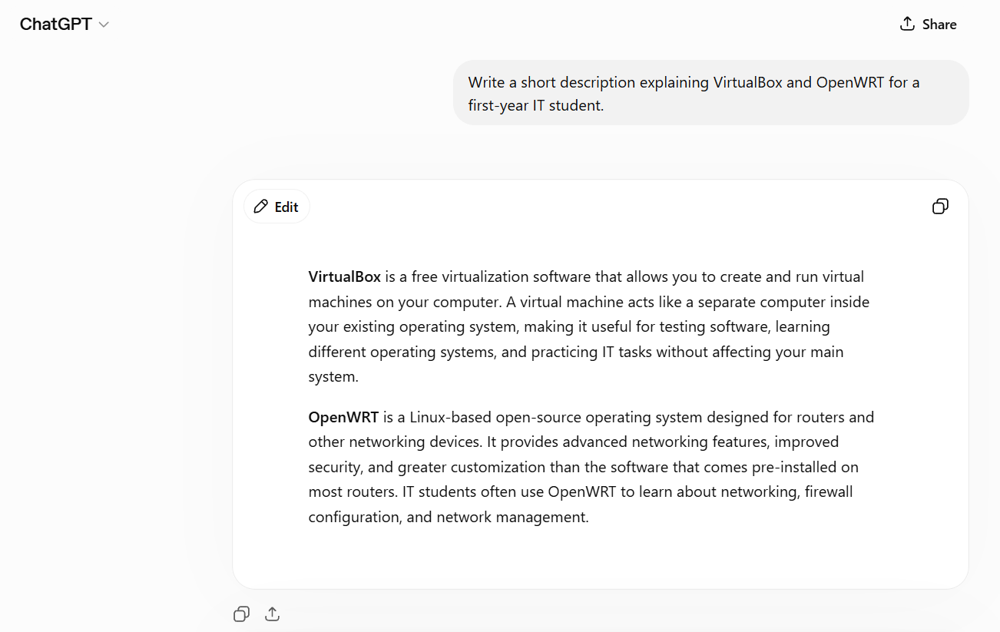
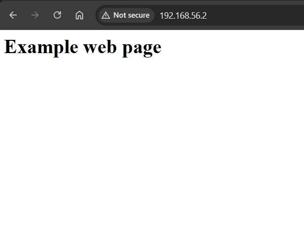
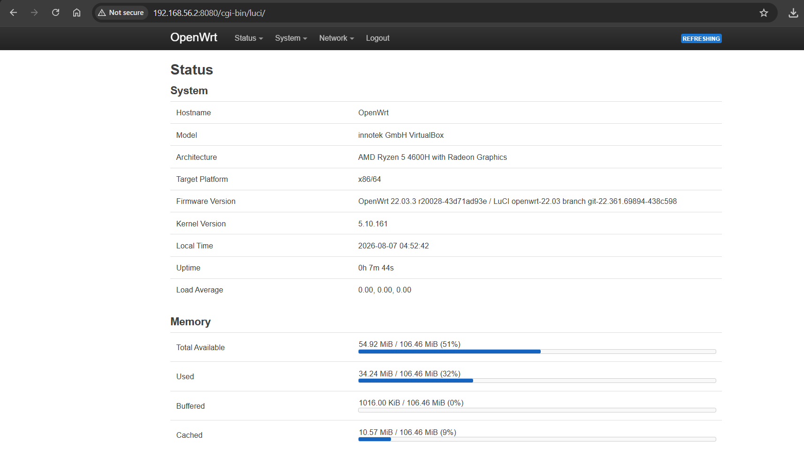
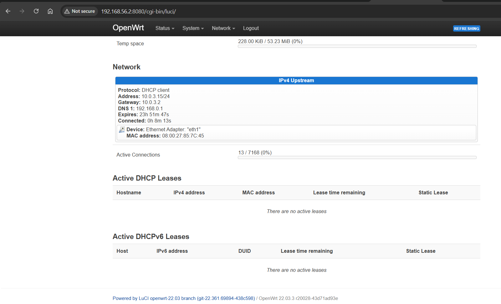

# Week 02 Journal – Computer Systems and Applications

**Assessment:** COIT20246 Assessment 1 Part A  
**Due Date:** 7 August 2026  
**Organisation:** Semitech  
**Code:** Rohit2421

**Student Name:** ___________________________

**Student ID:** ___________________________

---

# Task 1 – Knowledge Test

The Week 1 Knowledge Test was completed successfully through Moodle.

---

# Task 2 – View Your Computer Information

## Objective

The objective of this activity was to use Windows PowerShell to obtain information about the computer hardware and operating system.

---

## Commands Used

```powershell
Get-ComputerInfo

Get-CimInstance Win32_Processor

Get-CimInstance Win32_PhysicalMemory

Get-CimInstance Win32_LogicalDisk
```

---

## Screenshot



---

## Computer Specifications

| Component | Value |
|-----------|-------|
| Computer Name | Rohit |
| Processor | AMD Ryzen 5 4600H with Radeon Graphics |
| Maximum Clock Speed | 3000 MHz |
| Installed RAM | 16 GB (17,179,869,184 Bytes) |
| RAM Manufacturer | Hynix |
| RAM Speed | 2400 MHz |
| Operating System | Windows 10 Home Single Language |
| Windows Version | 19041.1 |
| Local Disk (C:) | 237.14 GB |
| Local Disk (D:) | 931.51 GB |

---

## Discussion

Windows PowerShell provides an efficient way to retrieve detailed hardware and operating system information. Using built-in commands, information regarding the processor, installed memory, storage devices and Windows version was collected. These commands are useful for troubleshooting, documentation and system administration.

---

# Task 3 – Deploy Linux Web Server in VirtualBox

## Objective

The objective of this activity was to deploy the supplied OpenWRT virtual appliance using Oracle VirtualBox and examine its Linux operating system.

---

## Commands Used

```bash
cat /etc/openwrt_release

uname -a

cat /proc/version

uptime

free -m
```

---

## Linux System Information

| Item | Value |
|------|-------|
| Operating System | OpenWRT |
| Release | 22.03.3 |
| Revision | r20028-43d71ad93e |
| Architecture | x86_64 |
| Kernel Version | Linux 5.10.161 |
| Virtual Machine | Oracle VirtualBox |

---

## Description of VirtualBox

Oracle VirtualBox is desktop virtualisation software that allows multiple operating systems to run simultaneously on a single physical computer. Each virtual machine operates independently with its own virtual hardware, allowing operating systems to be installed, tested and managed safely without affecting the host operating system.

---

## Description of OpenWRT

OpenWRT is an open-source Linux operating system designed primarily for routers and embedded networking devices. It provides advanced networking functionality including routing, DHCP, DNS, firewall management and package management. OpenWRT can be administered using both the Linux command line and the LuCI web interface.

---

## AI Prompt

```
Write a short description explaining VirtualBox and OpenWRT for a first-year IT student.
```

---

## AI Response



---

## Comparison

My explanation focused on the practical use of VirtualBox and OpenWRT within this laboratory exercise, whereas the AI-generated explanation provided a broader overview suitable for beginners. Both descriptions correctly explain the purpose of virtualisation and the role of OpenWRT as a Linux-based router operating system.

---

# Task 4 – Browse OpenWRT Websites

## Example Website

The OpenWRT appliance successfully hosted the supplied example website, confirming that the embedded web server was functioning correctly.

---

## Screenshot – Example Website



---

## Accessing the Management Interface

Initially the appliance displayed only the example webpage on port 80. The HTTP service was reconfigured to listen on port **8080**, allowing access to the LuCI management interface at:

```
http://192.168.56.2:8080/cgi-bin/luci/
```

---

## Screenshot – OpenWRT System Information



---

## OpenWRT System Information

| Item | Value |
|------|-------|
| Hostname | OpenWrt |
| Model | innotek GmbH VirtualBox |
| Architecture | x86/64 |
| Firmware Version | OpenWrt 22.03.3 r20028-43d71ad93e |
| Kernel Version | 5.10.161 |
| Total Memory | 106.46 MiB |
| CPU Architecture | AMD Ryzen 5 4600H with Radeon Graphics |

---

## Screenshot – OpenWRT Network Information



---

## Network Configuration

| Item | Value |
|------|-------|
| Protocol | DHCP Client |
| IPv4 Address | 10.0.3.15/24 |
| Gateway | 10.0.3.2 |
| DNS Server | 192.168.0.1 |
| MAC Address | 08:00:27:85:7C:45 |

---

## Discussion

The LuCI management interface provides a convenient web-based method of monitoring and configuring OpenWRT. During this activity the firmware version, kernel version, memory usage and network configuration were examined. VirtualBox successfully provided isolated networking between the Windows host computer and the OpenWRT virtual machine.

---

# Reflection

This week's practical activities improved my understanding of computer hardware, Linux operating systems and virtualisation technologies. I learned how PowerShell can be used to retrieve detailed hardware information and how VirtualBox can host virtual machines safely on a Windows computer. Deploying OpenWRT also demonstrated how Linux-based routers are managed through both command-line tools and the LuCI web interface. These activities strengthened my understanding of operating systems, networking and virtualisation concepts.

---

# Screenshots to Include

## Task 2

- Get-ComputerInfo
- Get-CimInstance Win32_Processor
- Get-CimInstance Win32_PhysicalMemory
- Get-CimInstance Win32_LogicalDisk

---

## Task 4

### Screenshot 1

Example Website

```
http://192.168.56.2
```

---

### Screenshot 2

LuCI System Page

Shows:

- Hostname
- Firmware Version
- Kernel Version
- Memory
- Architecture

---

### Screenshot 3

LuCI Network Page

Shows:

- Protocol
- IPv4 Address
- Gateway
- DNS Server
- MAC Address

---

# Files Required

```
week02.pdf

images/week2-task2-computerinfo.png

images/week2-task4-openwrt.png

images/week2-task4-system.png

images/week2-task4-network.png
```