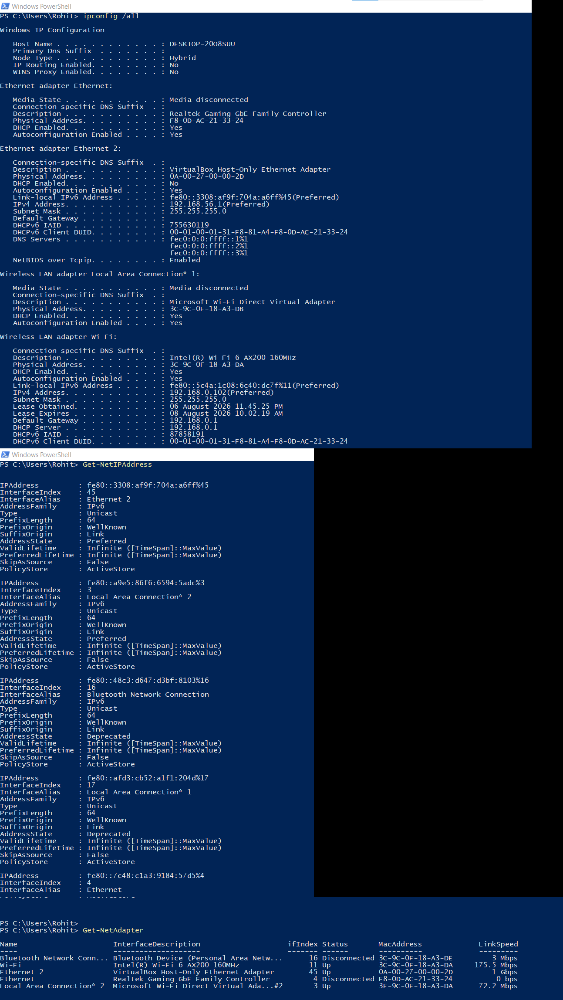
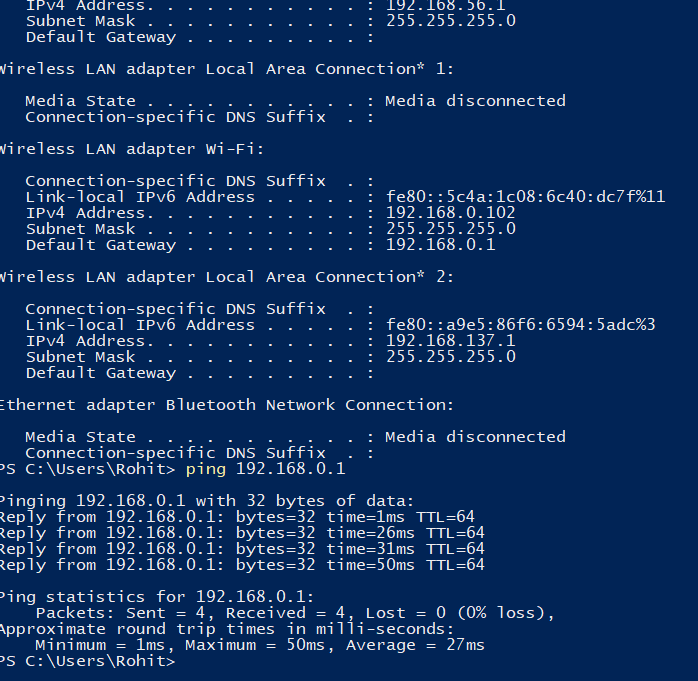
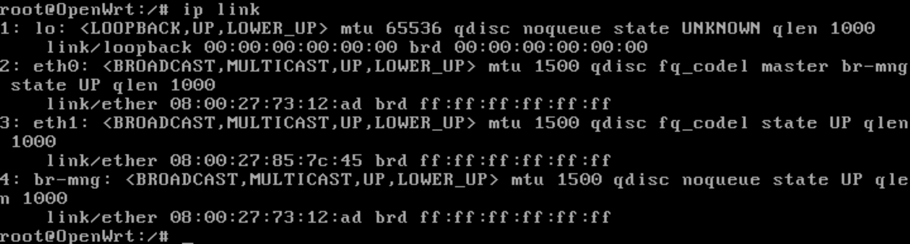
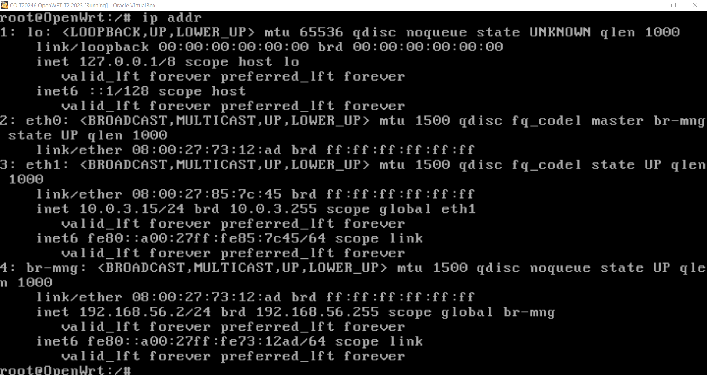
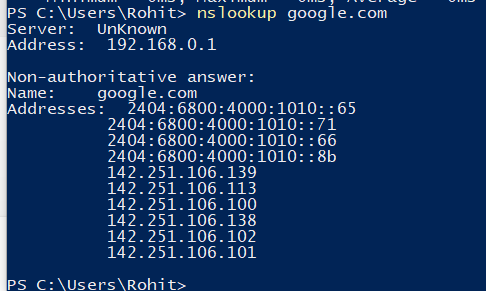
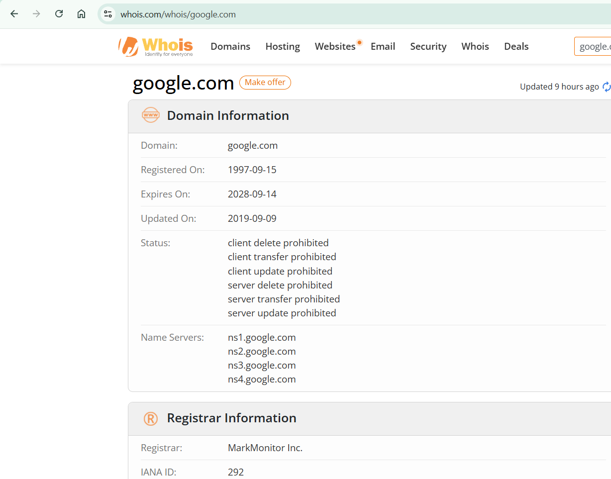

# Week 03 Journal – Computer Systems and Applications

**Assessment:** COIT20246 Assessment 1 Part A  

**Student Name:** Rohit Hargovanbhai Prajapati

**Student ID:** 12326317

---

# Task 1 – Knowledge Test

The Week 2 Knowledge Test was completed successfully through Moodle.

---

# Task 2 – View Your Network Addresses

## Objective

The objective of this task was to examine the network configuration of the Windows host computer using PowerShell commands.

---

## Commands Used

```powershell
ipconfig /all

Get-NetIPAddress

Get-NetAdapter
```

---

## Screenshot



---

## Network Information

| Item | Value |
|------|-------|
| Host Name | DESKTOP-20O8SUU |
| IPv4 Address (Wi-Fi) | 192.168.0.102 |
| IPv6 Address | fe80::5c4a:1c08:6c40:dc7f%11 |
| VirtualBox Host-Only IPv4 | 192.168.56.1 |
| Default Gateway | 192.168.0.1 |
| DNS Server | 192.168.0.1 |
| Wi-Fi MAC Address | 3C-9C-0F-18-A3-DA |
| VirtualBox MAC Address | 0A-00-27-00-00-2D |

---

## Discussion

PowerShell provides several networking commands that allow detailed inspection of IP addressing, adapters, DNS configuration, and network interfaces. These commands are valuable for troubleshooting network connectivity and verifying computer network settings.

---

# Task 3 – Ping Your Router

## Objective

The objective of this task was to test connectivity between the host computer and the default gateway.

---

## Command Used

```powershell
ping 192.168.0.1
```

---

## Screenshot



---

## Results

| Measurement | Value |
|-------------|-------|
| Minimum | 1 ms |
| Maximum | 50 ms |
| Average | 27 ms |
| Packet Loss | 0% |

---

## Discussion

The ping test confirmed successful communication between the host computer and the local router. Four packets were transmitted and received successfully with no packet loss, indicating a stable local network connection.

---

# Task 4 – Ping the OpenWRT Virtual Machine

## Objective

The objective of this activity was to examine the OpenWRT network interfaces and capture ICMP packets while testing connectivity from the Windows host.

---

## Commands Used

```bash
ip link

ip addr

tcpdump -i br-mng -w week3-task4-ping.pcap
```

Windows command:

```powershell
ping 192.168.56.2
```

---

## Screenshot – OpenWRT Interfaces



---

## Screenshot – OpenWRT IP Addresses



---

## OpenWRT Network Information

| Item | Value |
|------|-------|
| Management Interface | br-mng |
| Management IP | 192.168.56.2/24 |
| WAN Interface | eth1 |
| WAN Address | 10.0.3.15/24 |
| Gateway | 10.0.3.2 |
| br-mng MAC Address | 08:00:27:73:12:AD |
| eth1 MAC Address | 08:00:27:85:7C:45 |

---

## Packet Capture

Packet capture was performed using **tcpdump** while ICMP packets were generated from the Windows host.

Packet capture file:

```
week3-task4-ping.pcap
```

---

## Discussion

The packet capture verified successful ICMP communication between the Windows host and the OpenWRT virtual machine. Capturing network packets using tcpdump is a valuable technique for analysing network traffic and troubleshooting connectivity problems.

---

# Task 5 – Academic Integrity Policy

The Student Academic Integrity Policy was reviewed and uploaded to the GitHub repository.

## Academic Integrity Levels

| Level | Description |
|---------|-------------|
| Level 1 | Minor breach of academic integrity. |
| Level 2 | Moderate breach involving inappropriate academic practices. |
| Level 3 | Significant academic misconduct affecting assessment integrity. |
| Level 4 | Serious academic misconduct with substantial penalties. |
| Level 5 | Most serious academic misconduct that may result in suspension or exclusion. |

---

# Task 6 – Journal Export

The completed journal was exported to PDF and saved as:

```
week03.pdf
```

---

# Task 7 – Website Address Information

## Website

```
google.com
```

---

## Screenshot – DNS Lookup



---

## Screenshot – WHOIS Lookup



---

## Results

| Item | Value |
|------|-------|
| Domain | google.com |
| IPv4 Address | 142.251.106.139 (example returned) |
| IPv6 Address | 2404:6800:4000:1010::65 (example returned) |
| DNS Server | 192.168.0.1 |
| Registrar | MarkMonitor Inc. |

---

## Discussion

DNS lookup was used to determine the IP addresses associated with the selected domain, while a WHOIS lookup provided domain registration information including the registrar. These tools are commonly used for network administration and domain investigation.

---

# Task 8 – Internet Speed Test

## Screenshot


---

## Results

| Measurement | Value |
|-------------|-------|
| Download Speed | 21.98 Mbps |
| Upload Speed | 47.72 Mbps |
| Ping | 6 ms |

---

## Discussion

The speed test measured the internet connection performance by recording download speed, upload speed, and network latency. These metrics provide an indication of the quality of the internet connection and its suitability for everyday networking tasks.

---

# Reflection

This week's practical activities improved my understanding of computer networking, IP addressing, network troubleshooting, packet capture, DNS resolution, and internet performance testing. I gained practical experience using PowerShell networking commands, Linux networking tools, packet analysis using tcpdump, and website information services such as DNS and WHOIS. These activities strengthened my understanding of how network devices communicate and how network issues can be diagnosed using industry-standard tools.