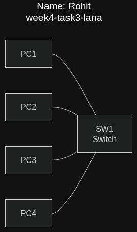
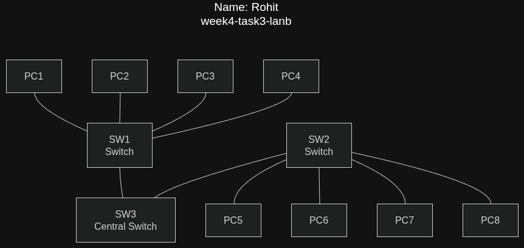
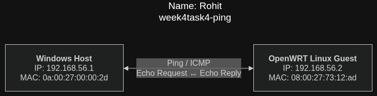
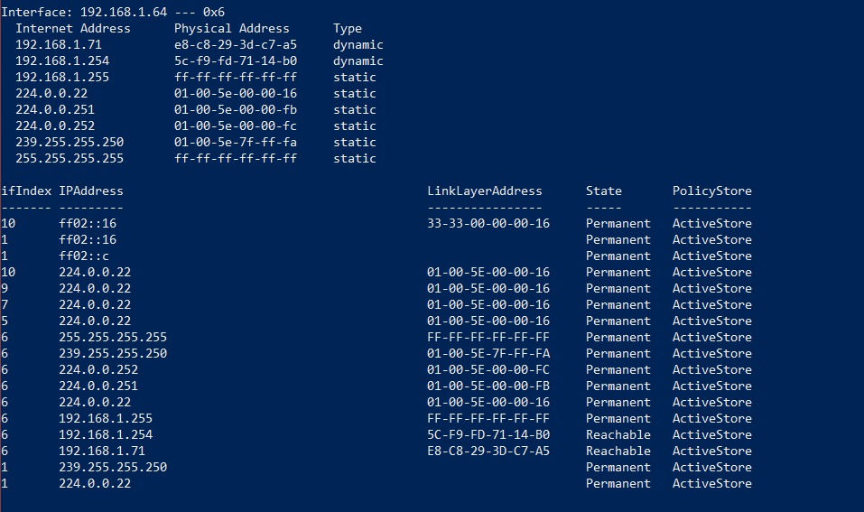

# Week 04 Journal – Network Technologies

**Assessment:** COIT20246 Assessment 1 Part B  

**Student Name:** Rohit Hargovanbhai Prajapati  

**Student ID:** 12326317

---

# Task 1 – Knowledge Test

The Week 4 Knowledge Test was completed successfully through Moodle.

---

# Task 2 – Project Initiation

## Objective

The objective of this activity was to begin the group project by accessing the **Group Formation – Project [30%]** section in Moodle and joining the tutorial group assigned to my class.

## Activity

I accessed the project group formation section in Moodle and selected the appropriate tutorial class. The activity required students to form groups of two students, with a maximum of one group of three students subject to tutor approval.

The project initiation activity helped me understand how the group for the upcoming assessment would be organised and how students are expected to join their allocated tutorial group.

## Screenshot


---

# Task 3 – Draw Network Diagrams

## Objective

The objective of this task was to use **diagrams.net (draw.io)** to create and understand basic switched LAN topologies.

Two different network diagrams were created.

## Part A – Switched LAN with One Switch

The first diagram represents a switched LAN containing one network switch and four PCs. Each device was given an appropriate label to make the topology easy to understand.

The four PCs are connected directly to the central switch. The switch provides the connectivity between the devices on the LAN.

### Network Diagram – Part A



### Original Draw.io File

`week4-task3-lana.drawio`

## Discussion

This topology is a simple example of a switched LAN. The switch acts as the central networking device and forwards Ethernet frames between the connected PCs. Using a switch allows the devices to communicate within the same local network without requiring a direct connection between every pair of computers.

---

## Part B – Switched LAN with Three Switches

The second diagram contains eight PCs and three switches. Four PCs are connected to the first switch and another four PCs are connected to the second switch. Both of these switches are connected to a third switch, creating a star-based topology.

### Network Diagram – Part B



### Original Draw.io File

`week4-task3-lanb.drawio`

## Discussion

This topology demonstrates how multiple switches can be connected together to expand a LAN. The two access switches provide connections for the eight PCs, while the third switch provides the central connection between the two groups.

The diagram was arranged neatly and labelled so that the relationship between the PCs and switches is clear.

---

# Task 4 – Analyse Ping Packet Capture

## Objective

The objective of this task was to analyse the operation of the **ping** command from a networking and protocol perspective. The packet capture was opened in Wireshark to examine ARP and ICMP packets and to understand how data is encapsulated as it travels through different network layers.

The ping communication was performed between the Windows host and the OpenWRT Linux virtual machine.

---

## Part A – Inspect Packets in Wireshark

The packet capture was inspected in Wireshark. Similar packets were grouped conceptually so that the different stages of the communication could be understood more clearly.

The main packets of interest were:

- ARP request
- ARP reply
- ICMP Echo Request
- ICMP Echo Reply

The ARP packets were used to discover the MAC address associated with the destination IP address before the ICMP communication could take place.

The ICMP packets were then used to test connectivity between the Windows host and the OpenWRT virtual machine.

---

## Part B – Network Diagram

The network diagram represents the communication between the Windows host and the OpenWRT virtual machine.

### Network Information

| Device | IP Address | MAC Address |
|--------|------------|-------------|
| Windows Host | 192.168.56.1 | 0A-00-27-00-00-2D |
| OpenWRT Linux VM | 192.168.56.2 | 08:00:27:73:12:AD |

The Windows host and OpenWRT management interface are on the same `192.168.56.0/24` network, allowing them to communicate directly on the local network.

### Network Diagram



### Original Draw.io File

`week4-task4-ping.drawio`

---

## Part C – Purpose of ARP Packets

**ARP (Address Resolution Protocol)** is used to determine the MAC address associated with an IPv4 address on a local network.

Before the Windows host can send the Ethernet frame containing the ICMP packet to OpenWRT, it needs to know the destination MAC address. The Windows host therefore sends an ARP request asking which device owns the IP address `192.168.56.2`.

The ARP request is sent as a broadcast on the local network because the Windows host does not initially know which device has that IP address.

The OpenWRT device receives the broadcast and recognises that the requested IP address belongs to its management interface. It then sends an ARP reply containing its MAC address.

In this communication:

- **ARP Request:** Windows host → Broadcast
- **Destination IP being resolved:** `192.168.56.2`
- **ARP Reply:** OpenWRT → Windows host
- **OpenWRT MAC Address:** `08:00:27:73:12:AD`

This ARP exchange allows the Windows host to build or update its ARP cache and then send the ICMP traffic to the correct Ethernet destination.

---

## Part D – Packet Diagram for the First ARP Packet

The first ARP packet was analysed as an Ethernet frame carrying an ARP message.

### Encapsulation

The packet can be represented as:

```text
+--------------------------------------------------+
| Ethernet II Header                               |
| Destination MAC: FF:FF:FF:FF:FF:FF              |
| Source MAC: 0A-00-27-00-00-2D                   |
| EtherType: 0x0806 (ARP)                          |
| 14 Bytes                                          |
+--------------------------------------------------+
| ARP Message                                       |
| Hardware Type: Ethernet                           |
| Protocol Type: IPv4                               |
| Hardware Size: 6                                  |
| Protocol Size: 4                                  |
| Operation: Request                                |
| Sender MAC / Sender IP                            |
| Target MAC / Target IP                            |
| 28 Bytes                                          |
+--------------------------------------------------+

Total Ethernet frame size shown by Wireshark:
42 Bytes
```

The Ethernet header is **14 bytes**, while the ARP message is **28 bytes**. Therefore, the Ethernet frame contains **42 bytes** of captured Ethernet/ARP data. The Ethernet FCS is normally not included in the captured frame by many network interfaces.

### Packet Diagram

.png)

### Original Draw.io File

`week4task4-part(d).drawio`

---

## Discussion of ARP Encapsulation

ARP is carried directly inside an Ethernet frame rather than inside an IP packet. The Ethernet header provides the source and destination MAC addresses and identifies ARP using EtherType `0x0806`.

Because the Windows host is looking for the MAC address of `192.168.56.2`, the ARP request is sent to the Ethernet broadcast address:

`FF:FF:FF:FF:FF:FF`

This allows every device on the local Ethernet segment to receive the request. The device that owns the requested IP address can then respond with its MAC address.

---

## Part E – Explain the First Two ICMP Packets

After the ARP process has resolved the destination MAC address, the Windows host can send the ping traffic to OpenWRT.

The first ICMP packet is an **ICMP Echo Request**. It is generated by the Windows host to test whether the OpenWRT device at `192.168.56.2` is reachable.

The second ICMP packet is the corresponding **ICMP Echo Reply**. OpenWRT responds to the Echo Request and sends the response back to the Windows host.

The communication can therefore be summarised as:

```text
Windows Host                         OpenWRT
192.168.56.1                         192.168.56.2
      |                                     |
      | ---- ICMP Echo Request ------------>|
      |                                     |
      | <---- ICMP Echo Reply --------------|
      |                                     |
```

The Echo Request tests connectivity to the destination, while the Echo Reply confirms that the destination received the request and responded.

---

## Part F – Packet Diagram for the First ICMP Packet

The first ICMP packet contains several layers of encapsulation. The ICMP message is carried inside an IPv4 packet, which is then carried inside an Ethernet frame.

### Encapsulation

```text
+--------------------------------------------------+
| Ethernet II Header                               |
| Source MAC: Windows Host                         |
| Destination MAC: OpenWRT                         |
| EtherType: 0x0800 (IPv4)                         |
| 14 Bytes                                          |
+--------------------------------------------------+
| IPv4 Header                                       |
| Source IP: 192.168.56.1                          |
| Destination IP: 192.168.56.2                     |
| Protocol: ICMP (1)                                |
| 20 Bytes                                          |
+--------------------------------------------------+
| ICMP Header + Data                                |
| Type: 8 (Echo Request)                            |
| Code: 0                                           |
| Checksum                                          |
| Identifier / Sequence Number                      |
| ICMP Data                                         |
+--------------------------------------------------+
```

The Ethernet header and IPv4 header provide the information required to deliver the ICMP message across the local network and to the correct IP destination.

### Packet Diagram

.png)

### Original Draw.io File

`week4task4-part(f).drawio`

---

## Discussion

The packet capture demonstrates the relationship between different networking protocols. ARP is used first to resolve the destination IPv4 address to a MAC address on the local network. Once this information is available, ICMP packets can be transmitted using IPv4 and Ethernet.

This activity helped me understand that a simple `ping` command involves multiple protocols working together. The packet capture also made the concept of protocol layering and encapsulation clearer because the Ethernet, IP and ICMP information could be inspected separately in Wireshark.

---

# Task 5 – View ARP Table (Optional)

## Objective

The objective of this optional activity was to view the ARP table of the primary physical network adapter using PowerShell and observe how the table changes after communicating with other devices.

## Command Used

```powershell
arp -a
```

The ARP table can also be viewed using:

```powershell
Get-NetNeighbor
```

## Screenshot



## Discussion

The ARP table contains mappings between IPv4 addresses and MAC addresses that the computer has recently learned. When the computer communicates with another device on the local network, an ARP lookup may be performed if the destination MAC address is not already available in the ARP cache.

In a normal local network, reachable devices can appear in the ARP table after the computer communicates with them. The entries can then be used by the computer when sending Ethernet traffic to those devices.

### Reachable Devices

| Device | IP Address | MAC Address | Reason |
|--------|------------|-------------|--------|
| Device 1 | `192.168.1.71` | `e8-c8-29-3d-c7-a5` | Discovered through local network communication |
| Device 2 | `192.168.1.254` | `5c-f9-fd-71-14-b0` | Discovered through local network communication |

The MAC addresses and device identities above should be based on the entries visible in the ARP table screenshot.

---

# Reflection

This week's activities improved my understanding of switched LANs, network topologies, ARP, ICMP, Ethernet frames and protocol encapsulation. Creating the network diagrams in diagrams.net helped me visualise how computers and switches are connected in a LAN.

The Wireshark packet analysis was particularly useful because it allowed me to see what happens behind a simple `ping` command. I learned that the computer may first use ARP to discover the destination MAC address before sending the ICMP traffic. I also gained a better understanding of how Ethernet, IPv4 and ICMP work together through protocol layering.

Overall, the practical activities gave me a clearer understanding of how devices communicate on a local network and how packet captures can be used to investigate network communication at the protocol level.
