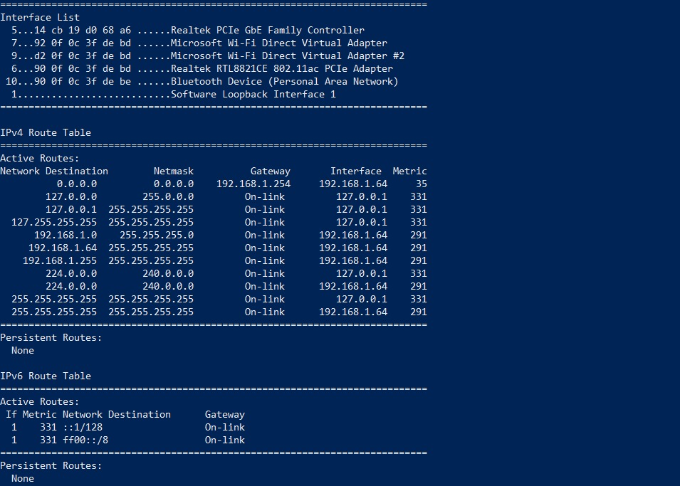
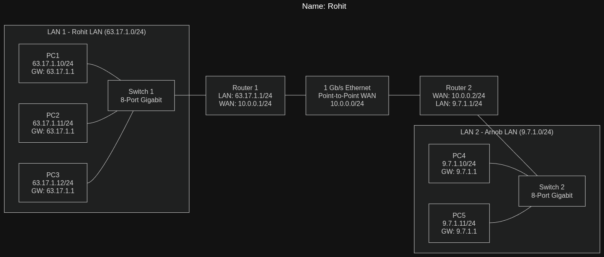
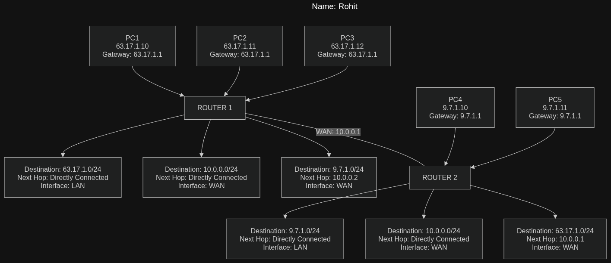
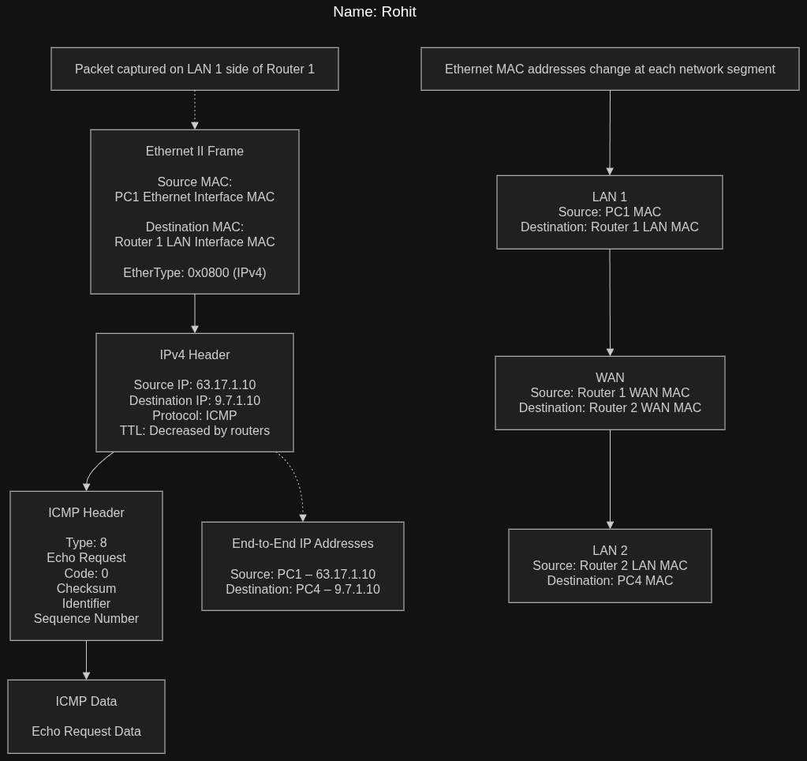

# Week 05 Journal – Internetworking

**Assessment:** COIT20246 Assessment 1 Part B  

**Student Name:** Rohit Hargovanbhai Prajapati  

**Student ID:** 12326317

---

# Task 1 – Knowledge Test

The Week 5 Knowledge Test was completed successfully through Moodle.

---

# Task 2 – View Routing Table

## Objective

The objective of this task was to use PowerShell to view the routing table of the primary network adapter and understand how the computer determines where network traffic should be sent.

## Command Used

```powershell
route print
```

The routing table can also be viewed using:

```powershell
Get-NetRoute
```

## Screenshot



## Reading the Routing Table

A routing table contains entries that tell the computer how to reach different destination networks. Each row can be interpreted by looking at the destination network, network mask or prefix, gateway, interface, and metric.

The main information in each routing entry can be understood as follows:

| Routing Table Information | Description |
|---------------------------|-------------|
| Destination | The network or IP address that the computer is trying to reach. |
| Network Mask / Prefix | Defines the size of the destination network. |
| Gateway | The next-hop device used to forward traffic when the destination is not directly connected. |
| Interface | Identifies the local network interface through which the traffic will be sent. |
| Metric | A value used to determine the preferred route when more than one route is available. |

### My Routing Table Entries

The following table describes the important rows shown in my PowerShell routing-table screenshot.

| Destination | Netmask | Gateway | Interface | Description |
|-------------|---------|---------|-----------|-------------|
| `0.0.0.0` | `0.0.0.0` | `192.168.1.254` | `192.168.1.64` | Default route used to forward traffic to networks that do not have a more specific route. |
| `127.0.0.0` | `255.0.0.0` | `On-link` | `127.0.0.1` | Route for the local loopback network. Traffic remains within the computer. |
| `127.0.0.1` | `255.255.255.255` | `On-link` | `127.0.0.1` | Route for the local loopback address of the computer. |
| `127.255.255.255` | `255.255.255.255` | `On-link` | `127.0.0.1` | Loopback broadcast route for the local loopback network. |
| `192.168.1.0` | `255.255.255.0` | `On-link` | `192.168.1.64` | Directly connected local network. Devices on the `192.168.1.0/24` network can be reached through the Wi-Fi interface. |
| `192.168.1.64` | `255.255.255.255` | `On-link` | `192.168.1.64` | Route for the computer's own IPv4 address on the local network. |
| `192.168.1.255` | `255.255.255.255` | `On-link` | `192.168.1.64` | Broadcast address for the local `192.168.1.0/24` network. |
| `224.0.0.0` | `240.0.0.0` | `On-link` | `127.0.0.1` | Route for IPv4 multicast traffic associated with the loopback interface. |
| `224.0.0.0` | `240.0.0.0` | `On-link` | `192.168.1.64` | Route for IPv4 multicast traffic on the local Wi-Fi network. |
| `255.255.255.255` | `255.255.255.255` | `On-link` | `127.0.0.1` | Limited broadcast route associated with the loopback interface. |
| `255.255.255.255` | `255.255.255.255` | `On-link` | `192.168.1.64` | Limited broadcast route associated with the local Wi-Fi interface. |

The exact values in this table should match the entries visible in the routing-table screenshot.

## Discussion

The routing table is important because it allows the computer to decide where packets should be forwarded. A directly connected destination can normally be reached through the local interface, while traffic for a different network is normally forwarded to a configured gateway or router.

This activity helped me understand that routing decisions are made using destination networks and that the routing table provides the information required to forward packets correctly.

---

# Task 3 – IP Network Design

## Objective

The objective of this task was to design a small test network consisting of two switched Ethernet LANs connected through a 1 Gb/s Ethernet point-to-point WAN link.

The network contains five PCs, two Gigabit Ethernet switches and two routers. The two LANs use separate IPv4 /24 networks, while the routers provide communication between the networks.

## Project Team

| Team Member | Student ID |
|-------------|------------|
| Rohit Hargovanbhai Prajapati | 12326317 |
| Lehanul Islam Arnob | 12310097 |

---

## Network Design

The network was divided into three IPv4 networks:

- **LAN 1:** `63.17.1.0/24`
- **LAN 2:** `9.7.1.0/24`
- **WAN:** `10.0.0.0/24`

The first two decimal values of the first LAN were selected from the last four digits of my student ID, `6317`, resulting in the `63.17.x.x` address range.

The partner's student ID ends in `0097`. Following the task requirement, the first two decimal values used for the second LAN are `9.7`.

The WAN network uses a separate private IPv4 network because it is a point-to-point connection between the two routers.

---

## Part A – IPv4 Network Addresses and Device Assignments

### Network Addresses

| Network | Purpose | Network Address | Subnet Mask |
|---------|---------|-----------------|-------------|
| LAN 1 | Rohit's LAN | `63.17.1.0/24` | `255.255.255.0` |
| WAN | Router-to-router connection | `10.0.0.0/24` | `255.255.255.0` |
| LAN 2 | Arnob's LAN | `9.7.1.0/24` | `255.255.255.0` |

### Device and Interface Addressing

| Device | Interface | Network | IPv4 Address | Subnet Mask |
|--------|-----------|---------|--------------|-------------|
| PC1 | Ethernet | LAN 1 | `63.17.1.10` | `255.255.255.0` |
| PC2 | Ethernet | LAN 1 | `63.17.1.11` | `255.255.255.0` |
| PC3 | Ethernet | LAN 1 | `63.17.1.12` | `255.255.255.0` |
| Router 1 | LAN Interface | LAN 1 | `63.17.1.1` | `255.255.255.0` |
| Router 1 | WAN Interface | WAN | `10.0.0.1` | `255.255.255.0` |
| Router 2 | WAN Interface | WAN | `10.0.0.2` | `255.255.255.0` |
| Router 2 | LAN Interface | LAN 2 | `9.7.1.1` | `255.255.255.0` |
| PC4 | Ethernet | LAN 2 | `9.7.1.10` | `255.255.255.0` |
| PC5 | Ethernet | LAN 2 | `9.7.1.11` | `255.255.255.0` |

The switches are Layer 2 devices in this design, so an IP address is not required for their basic switching function.

### Default Gateway Configuration

| Device | IP Address | Default Gateway |
|--------|------------|-----------------|
| PC1 | `63.17.1.10` | `63.17.1.1` |
| PC2 | `63.17.1.11` | `63.17.1.1` |
| PC3 | `63.17.1.12` | `63.17.1.1` |
| PC4 | `9.7.1.10` | `9.7.1.1` |
| PC5 | `9.7.1.11` | `9.7.1.1` |

---

## Part B – Network Diagram

The network consists of two separate switched Ethernet LANs.

The first LAN contains three PCs connected to Switch 1. Switch 1 is connected to Router 1. The second LAN contains two PCs connected to Switch 2, which is connected to Router 2.

Router 1 and Router 2 are connected using a 1 Gb/s Ethernet point-to-point WAN link.

### Network Diagram



### Original Draw.io File

`week5-task3-network.drawio`

---

## Network Topology

```text
PC1 ─┐
PC2 ─┼── Switch 1 ── Router 1 ═══ 1 Gb/s WAN ═══ Router 2 ── Switch 2 ──┬─ PC4
PC3 ─┘                                                                    └─ PC5
```

## Part C – Routing Tables

Simplified routing tables were created for the two routers.

### Router 1

| Destination Network | Next Hop | Interface |
|----------------------|----------|-----------|
| 63.17.1.0/24 | Directly connected | LAN interface |
| 10.0.0.0/24 | Directly connected | WAN interface |
| `<partner-first-two-values>.1.0/24` | 10.0.0.2 | WAN interface |

### Router 2

| Destination Network | Next Hop | Interface |
|----------------------|----------|-----------|
| `<partner-first-two-values>.1.0/24` | Directly connected | LAN interface |
| 10.0.0.0/24 | Directly connected | WAN interface |
| 63.17.1.0/24 | 10.0.0.1 | WAN interface |

These routing entries allow each router to identify whether a destination network is directly connected or must be reached through the other router.

### Routing Table Diagram



---

## Part D – ICMP/IP Packet at a Router

Assume that **PC1** sends an ICMP Echo Request to **PC4**.

The source and destination IP addresses remain the same while the packet travels through the routers:

- **Source IP:** `63.17.1.10`
- **Destination IP:** `<partner-first-two-values>.1.10`
- **Protocol:** ICMP
- **Message:** Echo Request

At Router 1, the packet is received on the LAN interface and forwarded through the WAN interface towards Router 2.

### Packet Structure

```text
+--------------------------------------------------+
| Ethernet Frame                                   |
| Source MAC: Router 1 LAN/WAN interface*         |
| Destination MAC: Next-hop device/interface*     |
+--------------------------------------------------+
| IPv4 Header                                      |
| Source IP: 63.17.1.10                            |
| Destination IP: <partner-first-two-values>.1.10 |
| Protocol: ICMP                                   |
+--------------------------------------------------+
| ICMP Header                                      |
| Type: 8 – Echo Request                           |
| Code: 0                                          |
+--------------------------------------------------+
| ICMP Data                                        |
+--------------------------------------------------+
```

\* The exact Ethernet MAC addresses depend on which router interface and network segment the packet is being captured on.

### Important Point

The **IP source and destination addresses remain the end-host addresses** as the packet is routed between networks, apart from normal routing-related changes such as the IPv4 TTL being reduced at each router.

The Ethernet MAC addresses, however, are associated with the devices on the **current local link**. Therefore, the Ethernet frame is different on different network segments.

For example:

- On the first LAN, the frame is between the source PC and Router 1.
- On the WAN link, the frame is between Router 1 and Router 2.
- On the second LAN, the frame is between Router 2 and the destination PC.

### Packet Diagram



### Original Draw.io File

`week5-task3-packet.drawio`

---

# Task 4 – Academic Integrity Outcomes

## Objective

The objective of this activity was to discuss hypothetical academic integrity scenarios and consider how students could avoid academic misconduct, the possible level of a breach, and the potential consequences.

## Selected Scenario

**Scenario:** `<Insert the scenario provided by the tutor>`

### Discussion

The selected scenario involved a student who `<briefly describe what happened in the scenario>`.

The main issue in this situation was that the student's actions could affect the integrity and fairness of the assessment process. Students are expected to complete assessment work honestly and follow the academic integrity requirements provided by the university.

### a) How the Student Could Have Avoided the Problem

The student could have avoided the problem by:

1. Completing the assessment using their own work and understanding rather than using unauthorised material or assistance.
2. Asking the tutor for clarification or support when they were unsure about assessment requirements.

### b) Academic Integrity Breach and Outcome

Based on the scenario, the relevant academic integrity level and outcome should be identified according to the applicable CQU policy.

**Breach level:** `<Insert level from tutor scenario / CQU policy>`

**Likely outcome:** `<Insert outcome discussed in class>`

The outcome is intended to address the academic integrity issue and maintain fairness across students completing the assessment.

### c) Future Ramifications

If academic misconduct occurs but is not detected during the teaching term, it may still create problems later. Evidence of misconduct can potentially be identified through later investigations or assessment-related processes. It can also affect confidence in the student's submitted work and may have consequences under university academic integrity procedures.

## Recommendations to Other Students

1. **Complete assessment work honestly:** Students should use their own work and only use resources or assistance that are permitted by the assessment requirements.

2. **Ask for help when unsure:** If there is uncertainty about collaboration, referencing, artificial intelligence, or other assessment requirements, students should ask the tutor or university for clarification before submitting the work.

---

# Task 5 – IP Address Lookup

## Objective

The objective of this activity was to use an online IP address lookup service and compare the information obtained from two different network connections.

## Network 1 – `<Home Wi-Fi / Campus / Other>`

**IP address shown:** `<IP address>`

**Location shown:** `<Location shown by website>`

**Other information shown:** `<ISP / organisation / other information>`

### Screenshot


## Network 2 – `<Mobile Data / Home Wi-Fi / Other>`

**IP address shown:** `<IP address>`

**Location shown:** `<Location shown by website>`

**Other information shown:** `<ISP / organisation / other information>`

### Screenshot


## Comparison

The two network tests showed that the public IP address and location information can change when a different network connection is used.

The lookup service did not identify my exact physical location. Instead, it provided location information associated with the public IP address, such as a general city or region. The accuracy therefore depends on how the IP address is registered and how the lookup service maps that address to a geographical location.

The IP address shown by the website represents the public-facing address of the network connection. It does not necessarily represent the private IP address assigned to my computer inside the local network.

### Results

| Item | Network 1 | Network 2 |
|------|-----------|-----------|
| Public IP | `<IP>` | `<IP>` |
| City / Region | `<Location>` | `<Location>` |
| ISP / Organisation | `<ISP>` | `<ISP>` |
| Exact physical location identified? | `<Yes/No>` | `<Yes/No>` |

## Discussion

This activity demonstrated that IP geolocation should not be treated as an exact method of identifying a person's physical location. The information provided by an IP lookup service is generally associated with the network or ISP and may identify a city or broader region rather than the exact location of the computer.

Using two different networks also demonstrated that a device can appear with a different public IP address depending on the network connection being used.

---

# Reflection

This week's activities improved my understanding of internetworking and how routers connect separate IP networks. Viewing the routing table helped me understand how a computer determines where packets should be sent and how gateways and interfaces are used during packet forwarding.

Designing the test network was useful because it required me to assign IPv4 addresses, separate the LANs into different networks, configure router interfaces conceptually, and create routing tables. The packet diagram also helped me understand the difference between IP addressing and Ethernet addressing. IP addresses identify the end hosts involved in communication, while MAC addresses are used for delivery across the current local network segment.

The academic integrity activity reinforced the importance of completing assessment work honestly and understanding the rules before submitting work. Finally, the IP address lookup activity showed that an IP address can provide general network and geographical information, but it does not necessarily reveal an exact physical location.

Overall, the Week 5 activities gave me a better practical understanding of routing, IPv4 network design, packet forwarding, Ethernet addressing, and the relationship between different network layers.
