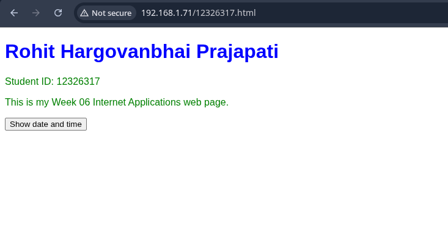
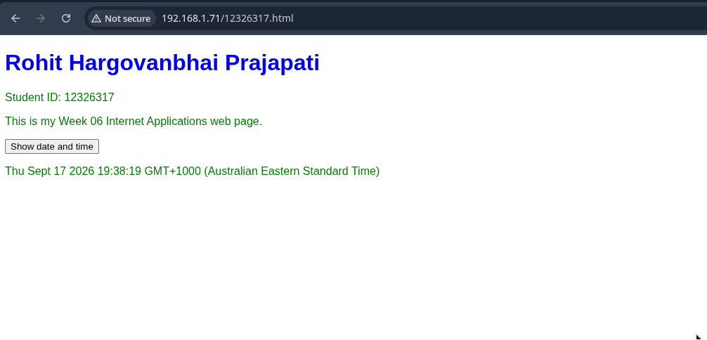
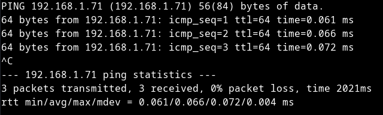
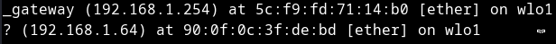
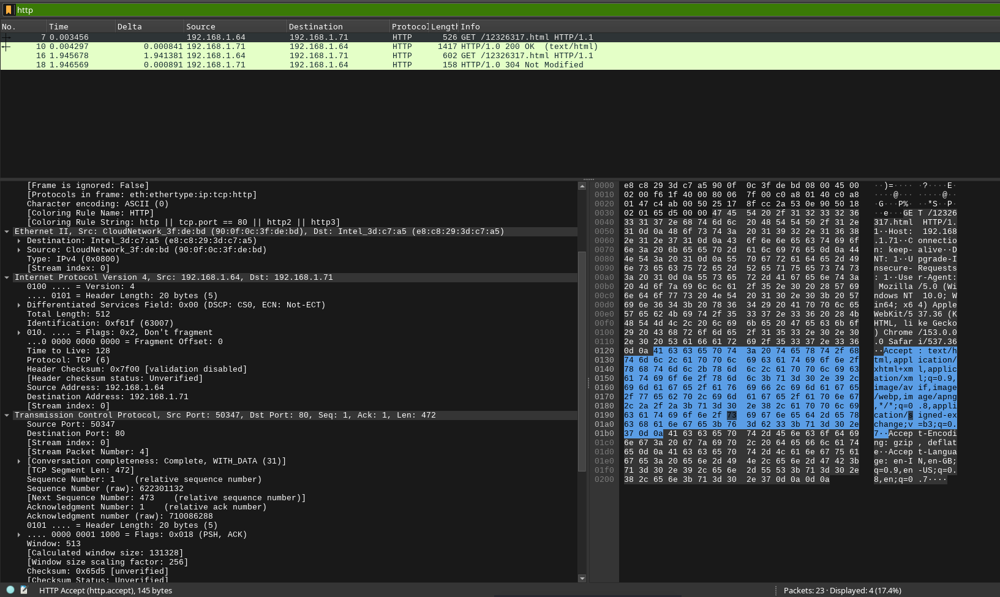
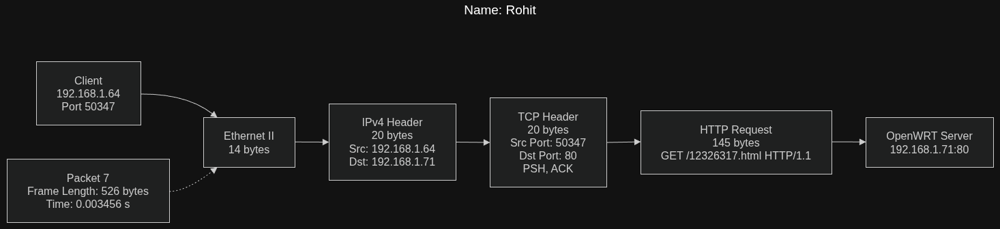
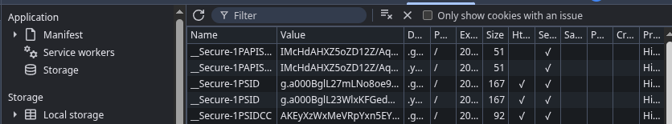

# COIT20246 Networking and Cyber Security

## Week 06 – Internet Applications

**Student Name:** Rohit Hargovanbhai Prajapati  
**Student ID:** 12326317  
**Week:** 06  
**Topic:** Internet Applications

---

## Task 1 – Knowledge Test

I completed the Week 06 knowledge test as part of the tutorial activities.

---

## Task 2 – Create Web Pages

For this task, I created a simple web page using HTML, CSS and JavaScript. The page includes my name, student ID and information about the Week 06 Internet Applications activity.

The files used for the page were:

```text
index.html
12326317.html
mystyle.css
```

The `12326317.html` page contains a **Show date and time** button. JavaScript handles the button click and displays the current date and time directly in the browser.

### Web page before pressing the button



### Web page after pressing the button



The second screenshot shows my name, student ID and the date/time displayed after pressing the button.

---

## Task 3 – Capture HTTP Packets

I used `tcpdump` to capture the HTTP traffic generated while accessing my web page. My Python HTTP server was running on my Arch Linux system and was available at:

```text
http://192.168.1.71/
```

My student page was:

```text
http://192.168.1.71/12326317.html
```

The capture was saved as:

```text
http-12326317.pcap
```

The HTTP traffic analysed in Wireshark was between the client at `192.168.1.64` and the web server at `192.168.1.71`.

### Connectivity test

I tested connectivity to the server using `ping`. Three packets were sent and all three replies were received, giving 0% packet loss.



### ARP table

The ARP table showed the local gateway and client device. The entries visible in my screenshot included:

```text
192.168.1.254  -> 5c:f9:fd:71:14:b0
192.168.1.64   -> 90:0f:0c:3f:de:bd
```



---

## Task 4 – Analyse HTTP Packet Capture

I opened `http-12326317.pcap` in Wireshark and used the following display filter:

```text
http
```

The filtered capture showed four HTTP packets:

| Packet | Time (s) | Source | Destination | Information |
|---|---:|---|---|---|
| 7 | 0.003456 | 192.168.1.64 | 192.168.1.71 | GET /12326317.html HTTP/1.1 |
| 10 | 0.004297 | 192.168.1.71 | 192.168.1.64 | HTTP/1.0 200 OK |
| 16 | 1.945678 | 192.168.1.64 | 192.168.1.71 | GET /12326317.html HTTP/1.1 |
| 18 | 1.946569 | 192.168.1.71 | 192.168.1.64 | HTTP/1.0 304 Not Modified |



### a) HTTP requests and responses

**Packet 7:** The browser requested my student page using:

```text
GET /12326317.html HTTP/1.1
```

The request was sent from `192.168.1.64` to `192.168.1.71`. The request was generated when the browser accessed the student page.

**Packet 10:** The server replied with:

```text
HTTP/1.0 200 OK
```

This indicates that the requested page was successfully found and returned to the browser.

**Packet 16:** The browser sent another request for:

```text
GET /12326317.html HTTP/1.1
```

This was another request for the same student page.

**Packet 18:** The server replied:

```text
HTTP/1.0 304 Not Modified
```

This indicates that the resource had not changed compared with the version already available to the browser.

### b) Address values for the first HTTP request

For Packet 7, the important address and protocol values were:

| Layer | Value |
|---|---|
| Ethernet source | `90:0f:0c:3f:de:bd` |
| Ethernet destination | `e8:c8:29:3d:c7:a5` |
| IP source | `192.168.1.64` |
| IP destination | `192.168.1.71` |
| TCP destination port | `80` |

The TCP source port was `50347`.

Therefore, the HTTP request travelled from the client at `192.168.1.64` to the server at `192.168.1.71` using TCP port 80.

### c) Date and time button

Clicking the **Show date and time** button did not generate another HTTP request to the web server.

The reason is that the button is handled by JavaScript running inside the browser. The JavaScript obtains the current date and time locally and places it on the page. It does not need to request another resource from the server.

This is consistent with the HTTP capture because there was no separate HTTP request generated specifically for the date/time button.

### d) Packet diagram

I used Packet 7 for the packet diagram because it contains the request for my newly created page.

The main values shown in Wireshark were:

- Frame length: **526 bytes**
- Ethernet II header: **14 bytes**
- IPv4 header: **20 bytes**
- IPv4 total length: **512 bytes**
- TCP header: **20 bytes**
- TCP payload: **472 bytes**
- HTTP request: **145 bytes**
- Source IP: `192.168.1.64`
- Destination IP: `192.168.1.71`
- Source TCP port: `50347`
- Destination TCP port: `80`

The packet is encapsulated as:

```text
Ethernet → IPv4 → TCP → HTTP
```



The original editable draw.io diagram is also included in the submission folder:

```text
week6-task4_HTTP_Packet_diagram.drawio
```

### e) Referrer

The HTTP request shown in Packet 7 does not contain a `Referer` header, so there is no referrer value in this request.

A referrer normally identifies the page from which a browser navigated to another resource. If a referrer is supplied, a web server can use it to understand where a request came from and analyse how users move between pages.

### f) Browser information

The request contained a `User-Agent` header. From this header, the server could learn information about the client browser and operating system.

The captured value identified a browser based on Chrome 153 running on Windows 10. The User-Agent also included information such as the Windows platform, WebKit and Safari-compatible browser identifiers.

### g) HTTP version and transport protocol

The request in Packet 7 used:

```text
HTTP/1.1
```

The response shown in Packet 10 was:

```text
HTTP/1.0 200 OK
```

The HTTP communication used **TCP** as the transport protocol and the server used TCP port **80**.

### h) TCP connection setup and data transfer

HTTP communication in the capture used TCP, which is connection-oriented. TCP normally establishes a connection using a three-way handshake:

```text
Client → Server : SYN
Server → Client : SYN-ACK
Client → Server : ACK
```

Packet 7 is shown by Wireshark as **Stream Packet Number 4** and contains application data. It has a TCP payload of 472 bytes and the PSH and ACK flags are set.

The HTTP request in Packet 7 occurred at **0.003456 seconds** in the capture. The exact elapsed time from the first SYN to the beginning of this data transfer depends on the timestamps of the three handshake packets in the complete unfiltered capture.

### i) TCP acknowledgements

TCP acknowledgements are used to confirm that data has been received. Packet 7 has the ACK flag set and Wireshark shows an acknowledgement number of `1`.

An acknowledgement is normally sent after receiving TCP data so that the sender knows that the data has arrived successfully. TCP uses these acknowledgements to provide reliable delivery.

---

## Task 5 – View Your Cookies

For this task, I used the browser Developer Tools and opened the cookie storage for a website.

The cookies shown in the browser included secure cookies such as:

```text
__Secure-1PAPISID
__Secure-1PSID
__Secure-1PSIDCC
```



I have not included the exact cookie values in this journal because cookie values can contain sensitive information.

The cookies can store different types of information depending on the website. Examples include session information, authentication or session identifiers, user preferences, security-related information and information that allows the website to recognise a browser.

Cookie attributes such as the domain, path, expiry information and security settings also determine where and how the cookie can be used.

This task helped me understand how websites maintain state between requests even though HTTP itself is stateless.

---

# Reflection

This week's activities gave me a much better understanding of how web applications communicate over a network.

Creating my own HTML page helped me understand the relationship between HTML, CSS and JavaScript. The date and time button was especially useful because I could see that an action on a web page does not always require a new HTTP request. In this case, JavaScript handled the action locally in the browser.

The packet capture was the most useful part of the practical work for me. Looking at the packets in Wireshark made it easier to understand how an HTTP request is carried inside TCP and IPv4. I was also able to identify the client and server addresses, TCP ports, HTTP request method, response codes and User-Agent information from an actual capture.

The cookie activity also showed how websites can keep information about a browser between different requests. Overall, the activities helped connect the theory of HTTP, TCP, addressing and cookies with traffic that I could actually observe.

---
