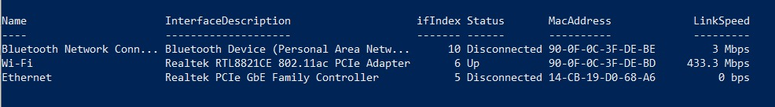
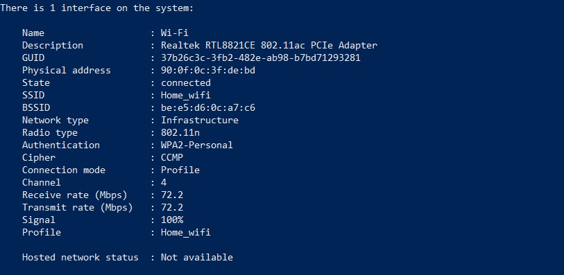
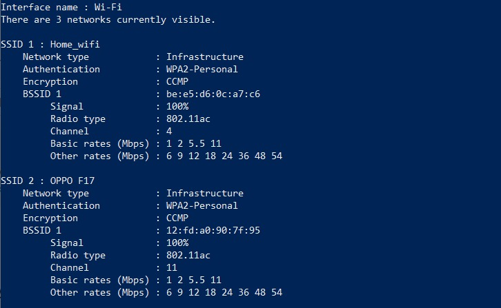
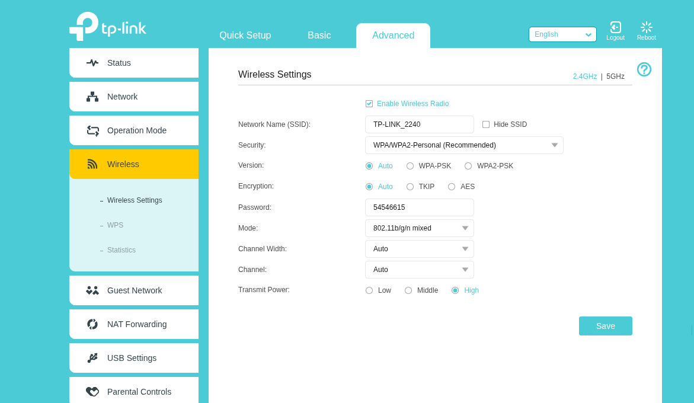
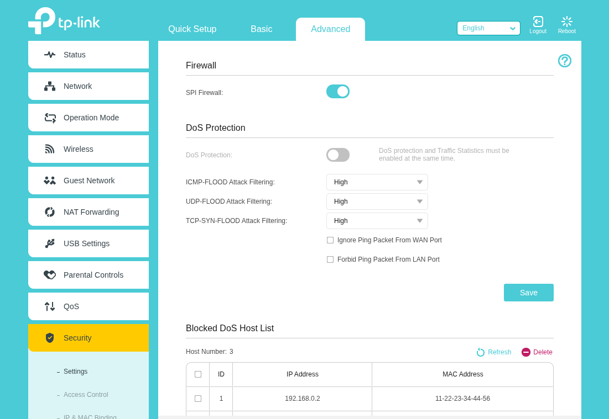
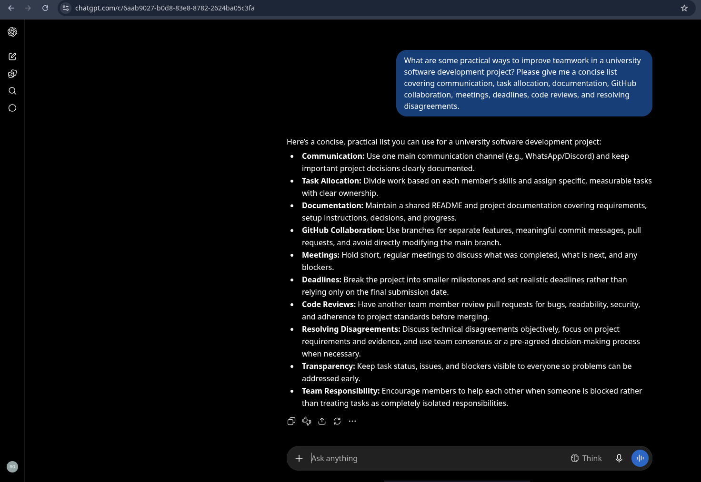

# Week 07 Journal – Wireless Networks

## Assessment

**Course:** COIT20246 Networking and Cyber Security  
**Topic:** Wireless Networks  
**Student Name:** Rohit Hargovanbhai Prajapati  
**Student ID:** 12326317  

---

## Task 1 – Knowledge Test

### Objective

The objective of this task was to complete the Week 07 knowledge test and review the concepts covered in the Wireless Networks topic.

### Result

The knowledge test was completed as part of the Week 07 tutorial activities.

---

## Task 2 – View Wi-Fi Details

### Objective

The objective of this task was to investigate wireless network information available from my Windows computer and identify information about nearby wireless access points. The tutorial asks for information such as the SSID, BSSID, frequency/radio type, channel and data rate.

### Commands Used

The following PowerShell commands were used to inspect the wireless adapter and available Wi-Fi networks:

```powershell
Get-NetAdapter
```

```powershell
netsh wlan show interfaces
```

```powershell
netsh wlan show networks mode=bssid
```

### 1. Network Adapter Information

The `Get-NetAdapter` command showed that the computer has a Realtek RTL8821CE 802.11ac PCIe Adapter for Wi-Fi. The Wi-Fi adapter was connected and had a reported link speed of 433.3 Mbps at the time of the check.



**Figure 1:** Windows network adapter information.

### 2. Connected Access Point

The connected wireless network was:

| Property | Value |
|---|---|
| SSID | `Home_wifi` |
| BSSID | `be:e5:d6:0c:a7:c6` |
| Wireless adapter | Realtek RTL8821CE 802.11ac PCIe Adapter |
| Network type | Infrastructure |
| Radio type | 802.11n |
| Authentication | WPA2-Personal |
| Encryption | CCMP |
| Channel | 4 |
| Receive rate | 72.2 Mbps |
| Transmit rate | 72.2 Mbps |
| Signal | 100% |

The computer was connected to `Home_wifi` with a signal strength of 100%. The reported receive and transmit rates were both 72.2 Mbps.



**Figure 2:** Detailed information for the connected Wi-Fi network.

### 3. Nearby Access Points

The nearby-network scan identified multiple wireless networks. Two examples visible in the scan were:

| SSID | BSSID | Signal | Radio Type | Channel | Security |
|---|---|---:|---|---:|---|
| `Home_wifi` | `be:e5:d6:0c:a7:c6` | 100% | 802.11ac | 4 | WPA2-Personal |
| `OPPO F17` | `12:fd:a0:90:7f:95` | 100% | 802.11ac | 11 | WPA2-Personal |

The scan also showed the basic and other supported rates reported by the access points.



**Figure 3:** Nearby wireless networks detected by Windows.

### Discussion

The Wi-Fi information demonstrates that an access point can be identified using its SSID and BSSID. The BSSID identifies the wireless interface of the access point, while the SSID is the name presented to users. The channel and radio type provide information about how the wireless network is operating.

The connected network was using channel 4 and the computer reported a 72.2 Mbps receive and transmit rate. Another visible network, `OPPO F17`, was operating on channel 11. Looking at nearby networks is useful when designing a Wi-Fi network because overlapping or congested channels can affect wireless performance.

---

## Task 3 – Use Wi-Fi Access Point

### Objective

The objective of this task was to explore the management interface of a wireless access point and identify important settings that should be considered when designing a Wi-Fi network. A TP-Link wireless router emulator was used for this activity.

The tutorial allows a TP-Link emulator to be used when access to a physical wireless router is not available. fileciteturn4file0L20-L29

### Wireless Settings Observed

The TP-Link wireless settings page provided options for:

- Wireless radio
- SSID/network name
- Wireless security
- WPA/WPA2 version
- Encryption
- Wireless mode
- Channel width
- Channel
- Transmit power



**Figure 4:** TP-Link wireless settings page.

### Important Settings and Proposed Changes

| Setting | Current/Example Setting | What I Would Consider Changing | Reason |
|---|---|---|---|
| Wireless Security | WPA/WPA2-Personal | Use WPA2-Personal or WPA3-Personal where supported | Stronger wireless security reduces the risk of unauthorised access. |
| Encryption | Auto | Use AES | AES is preferable to older encryption options such as TKIP. |
| Wireless Mode | 802.11b/g/n mixed | Use a modern mode appropriate for the connected devices | Removing unnecessary legacy modes can improve efficiency when older devices are not required. |
| Channel | Auto | Select a suitable low-interference channel after checking the local environment | Manual channel selection can reduce interference when the automatic choice is not optimal. |
| Channel Width | Auto | Use an appropriate width based on congestion and required performance | A wider channel can provide higher throughput but can also increase interference. |
| Transmit Power | High | Use the lowest level that provides reliable coverage | Excessive transmit power can increase interference with neighbouring networks. |
| SSID | `TP-LINK_2240` | Use a clear, non-identifying network name | A meaningful SSID makes the network easier to identify without exposing unnecessary personal information. |

### Security and Firewall Settings

The emulator also provided firewall and DoS protection settings. The SPI firewall was enabled in the displayed configuration. The page included controls for ICMP-FLOOD, UDP-FLOOD and TCP-SYN-FLOOD attack filtering.



**Figure 5:** TP-Link firewall and DoS protection settings.

### Discussion

When designing a wireless network, security should be considered together with performance and coverage. I would avoid unnecessary legacy wireless modes where possible, use modern encryption, and select a suitable channel based on the surrounding wireless environment.

The firewall settings are also important because the router can filter certain types of unwanted traffic. DoS protection can provide an additional layer of protection against traffic patterns associated with flooding attacks. However, security features should be configured carefully because overly restrictive settings can interfere with legitimate network traffic.

---

## Task 4 – Self-Evaluation of Teamwork

### Objective

The objective of this task was to reflect on teamwork in the project, compare current practices with recommendations generated by AI, and review the contribution of team members.

### Generative AI Prompt

The following prompt was used in ChatGPT:

> What are some practical ways to improve teamwork in a university software development project? Please give me a concise list covering communication, task allocation, documentation, GitHub collaboration, meetings, deadlines, code reviews, and resolving disagreements.



**Figure 6:** Generative AI prompt and generated recommendations for improving teamwork.

### Recommendations from Generative AI

The AI response suggested several practical teamwork practices:

1. Use a main communication channel and document important project decisions.
2. Divide work according to members' skills and assign clear ownership.
3. Maintain shared project documentation.
4. Use GitHub branches, meaningful commit messages and pull requests where appropriate.
5. Hold short and regular meetings to discuss completed work, next tasks and blockers.
6. Break the project into smaller milestones and use realistic deadlines.
7. Use code reviews to identify bugs, readability issues and security concerns.
8. Resolve technical disagreements objectively using project requirements and evidence.
9. Keep task status and blockers visible to the team.
10. Support other team members when they are blocked.

### Comparison with Project Teamwork

The AI recommendations provide a useful checklist for evaluating how a software development team works. In my project, GitHub is being used as the project repository and team members contribute work to the same project.

The recommendations about communication, task allocation and documentation are particularly relevant because a group project requires members to understand what others are working on and what remains to be completed. Clear task ownership can reduce duplicated work and make it easier to identify unfinished tasks.

The recommendation about meaningful Git commits is also relevant because commit history provides a record of how the project has developed. Keeping commits focused on meaningful changes makes the project history easier to understand.

### GitHub Contribution Review

The project repository is private, and the **Insights → Contributors** view shown in the tutorial was not available in the repository interface available to me. Therefore, I have not invented commit counts or a comparison with other teams.

Because the required Contributors evidence was not available, an accurate numerical comparison of the number of commits made by each team member or comparison with other teams cannot be made from the evidence collected for this journal.

A useful improvement for the remainder of the project is to maintain clear GitHub contribution records and use meaningful commit messages so that each member's work can be identified easily.

### Teamwork Improvements for the Remainder of the Project

Based on the AI recommendations, the following practices should be maintained or improved:

- Keep project communication clear and focused.
- Assign specific tasks to team members.
- Keep documentation updated as the project changes.
- Use meaningful Git commit messages.
- Communicate blockers early instead of waiting until the deadline.
- Review important changes before they become part of the final project.
- Discuss technical disagreements using project requirements and evidence.
- Regularly check overall project progress against the remaining deadlines.

---

## Task 5 – Continue Your Project

### Objective

The purpose of this task was to continue development of the group project and review the current project progress with the tutor.

### Project Progress

This task was used to continue work on the project during the Week 07 tutorial period.

### Tutor Feedback

No specific tutor feedback or detailed project-progress evidence was provided with the Week 07 evidence collected for this journal. Therefore, no specific feedback has been attributed to the tutor.

---

## Reflection

Week 07 helped me understand that wireless networking involves more than simply connecting a device to an access point. The Wi-Fi commands provided information about SSIDs, BSSIDs, channels, radio types and data rates, which are useful when analysing wireless networks.

Exploring the TP-Link emulator also showed how wireless security, encryption, channel selection, channel width, transmit power and firewall settings can affect the design of a network.

The teamwork activity was useful because it connected general software-development practices with the group project. In particular, clear communication, task ownership, meaningful GitHub commits, documentation and early discussion of problems can make collaborative work easier to manage.

---

## Evidence Included

| Evidence | Included |
|---|---|
| Wi-Fi adapter information | Yes |
| Connected Wi-Fi details | Yes |
| Nearby AP information | Yes |
| TP-Link wireless settings | Yes |
| TP-Link firewall settings | Yes |
| Generative AI prompt and output | Yes |
| GitHub Contributors screenshot | Not available because the required view was not available in the private repository interface |
| Specific tutor feedback | Not provided |
