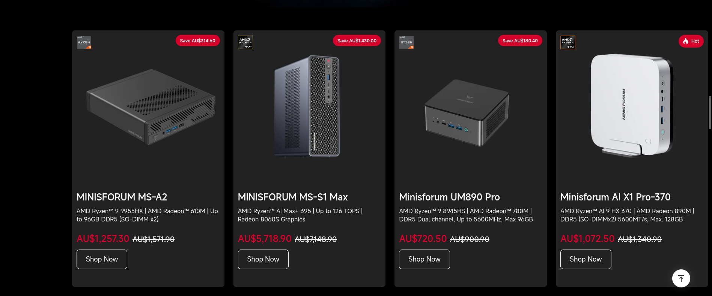
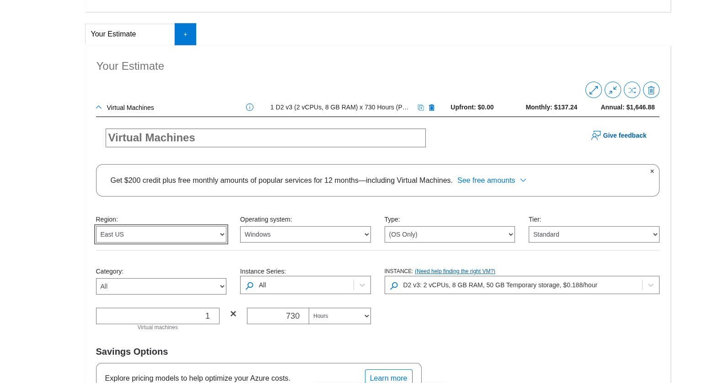

# Week 08 Journal – Cloud Computing

**Assessment:** COIT20246 Assessment 1 Part B

**Student Name:** Rohit Hargovanbhai Prajapati  
**Student ID:** 12326317

---

# Task 1 – Knowledge Test

The Week 08 Knowledge Test was completed through Moodle as required.

The knowledge test covered fundamental concepts related to cloud computing and Microsoft Azure.

---

# Task 2 – Microsoft Learn on Demand

I successfully logged in to Microsoft Learn on Demand using the Skillable account provided for the COIT20246 tutorial.

I accessed the **COIT20246** class and entered the Microsoft Azure Fundamentals activities.

The Azure environment used for this tutorial was a temporary lab environment provided through Microsoft Learn on Demand rather than my personal Microsoft Azure account.

---

# Task 3 – Create an Azure Resource

I completed **Module 01 – Create an Azure resource** through Microsoft Learn on Demand.

The Azure resources for the activity were created in the **Australia East** region.

## Resources Created

| Resource | Purpose |
|---|---|
| Resource Group | A logical container used to organise and manage related Azure resources. |
| Storage Account | Provides cloud storage for storing data and files in Azure. |
| Virtual Network | Provides networking infrastructure that allows Azure resources to communicate. |

The resource group allows related resources to be managed together. The storage account provides cloud storage, while the virtual network provides the networking environment used by Azure resources.

**Region:** Australia East

---

# Task 4 – Create an Azure Virtual Machine and Allow Web Access

I completed **Module 02 – Create a Virtual Machine** through Microsoft Learn on Demand.

The purpose of this task was to create an Ubuntu virtual machine in Azure, install Nginx, test web access, configure a Network Security Group to allow HTTP traffic, connect to the VM using SSH, and modify the web page to include my name.

## Azure Virtual Machine Details

| Property | Value |
|---|---|
| Operating System | Ubuntu Linux |
| Region | Australia East |
| VM Purpose | Web Server |
| Web Server | Nginx |
| HTTP Port | 80 |
| SSH Port | 22 |
| Network Security | Network Security Group |
| Administrator Username | azureuser |

The Azure virtual machine provides a cloud-based Linux computer. I used the VM as a web server by installing Nginx.

---

## Creating the Virtual Machine

The virtual machine was created through the temporary Azure environment provided by Microsoft Learn on Demand.

The VM was configured with Ubuntu Linux and the required networking resources. A public IP address was assigned so that the web server could be accessed from a web browser.

### Azure CLI Commands

The following commands show the Azure CLI configuration used for the practical activity:

```bash
az group create \
  --name myResourceGroup \
  --location australiaeast
```

```bash
az vm create \
  --resource-group myResourceGroup \
  --name myVM \
  --image Ubuntu2204 \
  --admin-username azureuser \
  --generate-ssh-keys
```

The HTTP port was then allowed for the virtual machine:

```bash
az vm open-port \
  --resource-group myResourceGroup \
  --name myVM \
  --port 80
```

---

## Installing Nginx

After creating the Ubuntu VM, I connected to the virtual machine and installed Nginx.

```bash
sudo apt update
```

```bash
sudo apt install nginx -y
```

I then checked the Nginx service:

```bash
sudo systemctl status nginx
```

Nginx is a web server that listens for HTTP requests and returns web pages to clients.

---

## Initial Website Test

Before allowing HTTP access through the Network Security Group, I attempted to access the website using the public IP address of the virtual machine.

The website returned a **connection timed out** error.

This showed that although the web server was running, incoming HTTP traffic was not yet permitted by the Azure Network Security Group.

The initial timeout was therefore useful because it demonstrated the effect of the network security configuration.

---

## Network Security Group

I opened the Network Security Group associated with the virtual machine and checked the inbound security rules.

The two relevant rules were:

| Port | Protocol | Purpose |
|---|---|---|
| 22 | TCP | Allows SSH connections for remote administration of the Ubuntu VM. |
| 80 | TCP | Allows HTTP connections to the Nginx web server. |

### Port 22 – SSH

TCP port **22** is used by Secure Shell (SSH).

SSH provides secure remote command-line access to the Ubuntu virtual machine. I used SSH to log in to the VM and modify the web page.

### Port 80 – HTTP

TCP port **80** is used by HTTP.

The HTTP rule allows a web browser to connect to the Nginx web server running on the Azure virtual machine.

---

## Adding the HTTP Security Rule

I opened:

**Azure Portal → Network Security Group → Inbound security rules → Add**

I selected **HTTP** as the service and added the rule.

The important configuration was:

```text
Service: HTTP
Port: 80
Protocol: TCP
```

After adding the rule, HTTP traffic was allowed to reach the VM.

I then accessed the website again using the VM's public IP address.

The website became accessible after the HTTP rule was added.

---

## SSH Connection

I connected to the Ubuntu virtual machine using SSH.

The SSH command used was:

```bash
ssh -l azureuser 40.118.232.15
```

where `40.118.232.15` represents the public IP address assigned to the Azure virtual machine.

If a host key verification error occurs, the following command can be used:

```bash
ssh -l azureuser 40.118.232.15 -o StrictHostKeyChecking=no
```

After successfully connecting, I was able to access the Ubuntu command line remotely.

---

## Editing the Web Page

After connecting through SSH, I edited the default Nginx web page using:

```bash
sudo nano /var/www/html/index.html
```

I modified the HTML page to display my name.

The page content was:

```html
<!DOCTYPE html>
<html>
<head>
    <title>COIT20246 Azure Web Server</title>
</head>
<body>
    <h1>Rohit Hargovanbhai Prajapati</h1>
    <p>COIT20246 Cloud Computing</p>
    <p>Azure Virtual Machine running Nginx</p>
</body>
</html>
```

I saved the file and exited the Nano editor.

---

## Final Website Test

After modifying the HTML file, I refreshed the website in the browser.

The Nginx web server displayed the updated web page containing my name:

**Rohit Hargovanbhai Prajapati**

This confirmed that:

- The Azure virtual machine was running.
- Ubuntu was operating correctly.
- Nginx was installed and serving the web page.
- HTTP port 80 was allowed through the Network Security Group.
- SSH provided remote access to the VM.
- The web page could be modified from the Ubuntu VM.
- The updated web page could be accessed through the VM's public IP address.

---

## Public IP Address

The VM was assigned a public IP address for external access.

**Public IP Address:** `40.118.232.15`

The public IP address should be copied from the Azure Portal because the Microsoft Learn on Demand environment uses temporary Azure resources.

---

# Task 5 – Compare Cloud vs On-premise Costs

## Objective

The purpose of this task was to compare the cost of an on-premise consumer desktop PC with the cost of a comparable cloud virtual machine using Microsoft Azure.

The comparison considers the computer specifications, upfront cost, running costs over one year and three years, and the advantages and disadvantages of each option.

---

## Consumer Desktop PC

I searched an Australian online computer retailer for a consumer desktop PC that could be compared with the Azure virtual machine.

### Selected Consumer PC

**Manufacturer:** Minisforum  
**Model:** UM890 Pro  
**Price shown:** **AU$720.50**

The product screenshot shows an AMD Ryzen 9 8945HS processor, AMD Radeon 780M graphics and DDR5 memory. The exact installed RAM and storage configuration should be taken from the Australian product listing and must satisfy the limits provided by the tutor.

### Consumer PC Specifications

| Specification | Consumer Desktop PC |
|---|---|
| Manufacturer | Minisforum |
| Model | UM890 Pro |
| CPU | AMD Ryzen 9 8945HS |
| Graphics | AMD Radeon 780M |
| RAM | **16 GB DDR5** |
| Storage | **1TB** |
| Operating System | **window** |
| Upfront Cost | **AU$720.50** |
| Monthly Running Cost | **AU$0 for the computer purchase itself** |
| 1-Year Hardware Cost | **AU$720.50** |
| 3-Year Hardware Cost | **AU$720.50** |

The consumer PC requires the full purchase price upfront. Electricity, maintenance, repairs and future hardware upgrades are additional costs and are not included in the AU$720.50 purchase price.

---

## Consumer PC Cost Evidence

The screenshot below shows the consumer desktop PC and its price in Australian dollars.



**Price shown in screenshot:** AU$720.50

---

## Cloud Virtual Machine – Microsoft Azure

For the cloud comparison, I used the Microsoft Azure Pricing Calculator.

The Azure VM selected for the comparison is a **D2 v3** virtual machine.

### Azure VM Configuration

| Specification | Azure VM |
|---|---|
| Cloud Provider | Microsoft Azure |
| VM Size | D2 v3 |
| vCPUs | 2 |
| RAM | 8 GB |
| Temporary Storage | 50 GB |
| Operating System | Windows |
| Region | **Australia East** |
| Pricing Model | Pay-as-you-go |
| Monthly Usage | 730 hours |
| Upfront Cost | AU$0 |
| Monthly Cost | **AU$[ENTER ACTUAL CALCULATOR MONTHLY COST]** |
| Annual Cost | **AU$[ENTER ACTUAL CALCULATOR ANNUAL COST]** |
| 3-Year Cost | **AU$[ENTER ACTUAL 3-YEAR COST]** |

### Azure Pricing Calculator Configuration

The Azure calculator was configured using the following values:

1. **Region:** Australia East
2. **Operating System:** Windows
3. **Type:** OS Only
4. **Tier:** Standard
5. **VM:** D2 v3
6. **vCPUs:** 2
7. **RAM:** 8 GB
8. **Usage:** 730 hours per month
9. **Number of VMs:** 1
10. **Currency:** AUD, where available

> The screenshot provided during the calculation currently shows **East US**. For the final journal evidence, change the region to **Australia East** and record the new AUD price shown by the calculator.

---

## Azure Pricing Calculator Evidence

The screenshot below should show the final Azure Pricing Calculator configuration and estimated price.



The final screenshot should clearly show:

- Australia East
- D2 v3
- 2 vCPUs
- 8 GB RAM
- Windows
- 730 hours
- Number of VMs = 1
- Monthly and/or annual estimated cost

---

## Cost Comparison

The following table compares the upfront and long-term costs of the two computing options.

| Cost | Consumer Desktop PC | Azure D2 v3 VM |
|---|---:|---:|
| Upfront Cost | AU$720.50 | AU$0 |
| Monthly Cost | AU$0* | **AU$137** |
| 1-Year Cost | AU$720.50* | **AU$1,646** |
| 3-Year Cost | AU$720.50* | **AU$4590** |

\*The consumer PC figures above represent the purchase price only. Electricity, maintenance, repairs and upgrades are not included.

---

## Comparison of Specifications

| Specification | Consumer Desktop PC | Azure D2 v3 |
|---|---|---|
| CPU | AMD Ryzen 9 8945HS | 2 vCPUs |
| RAM | **[ACTUAL RAM] GB DDR5** | 8 GB |
| Storage | **[ACTUAL STORAGE]** | 50 GB temporary storage |
| Graphics | AMD Radeon 780M | Azure VM virtualised graphics / standard VM configuration |
| Location | Physical computer | Azure Australia East |
| Ownership | Purchased and owned by user | Cloud resource rented from Microsoft |
| Access | Local / remote access can be configured | Remote cloud access |
| Payment | Upfront purchase | Recurring usage-based cost |

The two systems do not need to have identical specifications. The important requirement is that they are reasonably comparable and within the limits provided by the tutor.

---

## Advantages of the Consumer Desktop PC

The consumer desktop PC has several advantages:

- The hardware is purchased once and is owned by the user.
- There is no monthly cloud VM charge after the purchase.
- The computer can continue operating without an Internet connection for local tasks.
- The user has direct control over the physical hardware.
- Hardware components may be upgraded depending on the design of the computer.
- The computer can be used for different applications without paying a cloud provider for each hour of use.

---

## Disadvantages of the Consumer Desktop PC

The consumer desktop PC also has disadvantages:

- A relatively large upfront payment is required.
- The owner is responsible for hardware failures and repairs.
- Electricity is required while the computer is operating.
- Hardware can become outdated as software requirements increase.
- Upgrades may require additional purchases.
- Physical hardware requires space and maintenance.
- If the computer fails, the user may temporarily lose access to the system.

---

## Advantages of the Azure Cloud VM

The Azure virtual machine has several advantages:

- There is little or no upfront hardware purchase cost.
- A virtual machine can be created quickly.
- The VM can be accessed remotely through the Internet.
- Cloud resources can be changed when requirements change.
- Physical server maintenance is handled by the cloud provider.
- The VM can be stopped or deleted when it is no longer required.
- Cloud computing can be useful when resources are needed temporarily rather than continuously.

---

## Disadvantages of the Azure Cloud VM

The Azure virtual machine also has disadvantages:

- The user pays a recurring cost while the VM is running.
- Long-term continuous usage can result in significant cumulative costs.
- Additional services such as storage, networking and data transfer may introduce additional charges.
- Internet/network connectivity is important for remote access.
- The user does not own the underlying physical Azure hardware.
- The final price depends on factors such as VM size, operating system, region, usage and pricing model.
- Care is required to stop or delete resources that are no longer needed to avoid unnecessary charges.

---

## Trade-off Discussion

The main trade-off between the two options is the difference between **upfront ownership** and **recurring cloud usage costs**.

The consumer desktop PC requires an upfront payment of AU$720.50 based on the selected product screenshot. Once purchased, the user owns the hardware and does not have to pay a monthly cloud computing charge. However, electricity, maintenance, repairs and future upgrades can add to the total cost of ownership.

The Azure virtual machine has no hardware purchase cost because the physical infrastructure is provided by Microsoft Azure. Instead, the user pays for the VM according to its configuration and usage. This provides flexibility because the VM can be created when required and removed when it is no longer needed.

For short-term or variable workloads, the cloud model provides flexibility without requiring the user to purchase physical hardware. For long-term continuous use, the recurring Azure cost should be compared carefully with the purchase price and ongoing electricity/maintenance costs of an equivalent physical computer.

Other factors are also important besides price. Cloud computing provides remote accessibility and flexible resource management, while an on-premise computer provides physical ownership and local control.

Therefore, the cost comparison should consider both the financial costs and the practical requirements of the user.

---

## Final Cost Table

After completing the Azure calculator and confirming the PC specifications, I will use the following final table in my journal.

| Category | Consumer Desktop PC | Azure Cloud VM |
|---|---|---|
| Product / VM | Minisforum UM890 Pro | Azure D2 v3 |
| CPU | AMD Ryzen 9 8945HS | 2 vCPUs |
| RAM | **16 GB** | 8 GB |
| Storage | **1 TB** | 50 GB temporary |
| Region | Physical PC | Australia East |
| Upfront Cost | **AU$720.50** | **AU$0** |
| Monthly Cost | **AU$0 + electricity** | **AU$137** |
| 1-Year Cost | **AU$720.50 + electricity** | **AU$1,646** |
| 3-Year Cost | **AU$720.50 + electricity** | **AU$4590** |

---

## Conclusion

This task compared an on-premise consumer desktop PC with an Azure cloud virtual machine using Australian dollar costs.

The consumer PC has an upfront purchase cost, while the Azure VM uses a recurring cloud pricing model. The comparison shows that cost is only one factor when selecting between cloud and on-premise computing. Other factors include ownership, flexibility, accessibility, maintenance, electricity usage, scalability and expected duration of use.

The final cost figures in this comparison are based on the Australian PC price and the Azure Pricing Calculator configuration recorded in the evidence above.

# Task 6 – Create a Storage Blob

Task 6 was listed as an **optional** activity in the Week 08 tutorial.

The activity involved creating an Azure Storage Blob, uploading multiple images, and configuring different access levels.

The activity demonstrates how Azure Storage can be used to store files and how access controls can determine whether objects are private or publicly readable.

---

# Task 7 – Create a Resource Lock

Task 7 was listed as an **optional** activity in the Week 08 tutorial.

A resource lock can help protect Azure resources from accidental modification or deletion.

## Read-only Lock

A read-only lock prevents changes to a protected resource while allowing the resource to be viewed.

## Delete Lock

A delete lock prevents the protected resource from being deleted while still allowing permitted changes to the resource.

Resource locks can therefore provide an additional protection mechanism for important Azure resources.

---

# Reflection

This week's activities provided practical experience with Microsoft Azure and cloud computing.

Creating an Azure virtual machine helped me understand how a computer system can be provided as a cloud resource instead of requiring physical hardware. I also gained practical experience with Ubuntu Linux and Nginx.

The Network Security Group activity demonstrated the importance of controlling network traffic. SSH uses TCP port 22 for remote administration, while HTTP uses TCP port 80 for web traffic. Adding the HTTP rule allowed the browser to communicate with the Nginx web server.

Using SSH to modify `/var/www/html/index.html` also helped me understand how a Linux-based cloud server can be managed remotely. After modifying the page, I could access the updated website through the VM's public IP address.

The cloud versus on-premise comparison helped me understand that the two approaches have different cost models. A physical computer normally requires an upfront hardware investment, while a cloud VM uses an ongoing resource-based pricing model.

Overall, the Week 08 activities improved my understanding of Azure virtual machines, Network Security Groups, SSH, HTTP, Nginx, cloud storage, resource protection, and the financial trade-offs between cloud and on-premise computing.

---
